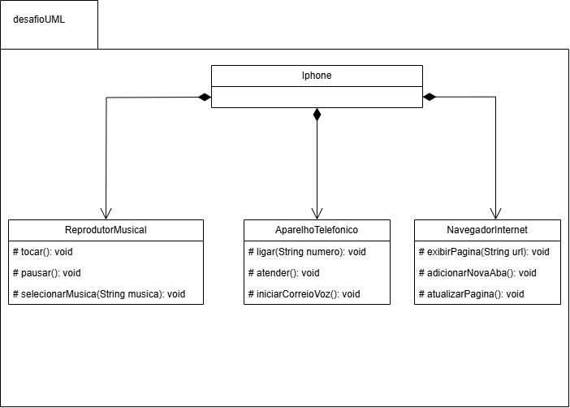

Este é o UML do desafio proposto: 

O diagrama foi desenvolvido utilizando a ferramenta draw.io. Ele demonstra a relação entre classes e métodos do sistema.

<h1> 📌 Estrutura</h1>  

A classe <strong>iPhone</strong> é composta por outras classes que representam as funcionalidades do dispositivo.

Neste diagrama, a relação é de composição e pode ser evidenciada da seguinte forma:

<ul>
  <li><strong>Reprodutor Musical:</strong> A classe <strong>iPhone</strong> contém a classe <strong>Reprodutor Musical</strong>, responsável por controlar a reprodução de músicas no dispositivo. </li>
  <li><strong>Aparelho Telefônico:</strong> De forma semelhante, o <strong>iPhone</strong> também contém a classe <strong>Aparelho Telefônico</strong>, que é responsável por realizar e atender chamadas, além de gerenciar o correio de voz.</li>
  <li><strong>Navegador Internet:</strong> O <strong>iPhone</strong> também contém a classe <strong>Navegador Internet</strong>, que é responsável pelas páginas e acesso a internet.</li>
</ul>

A relação de composição reflete que o <strong>iPhone</strong> contém o <strong>Reprodutor Musical</strong>, <strong>Navegador Internet</strong> e o <strong>Aparelho Telefônico</strong>, Essas classes dependem do iPhone para existir.

<h2> 📱 iPhone</h2>

 Representa o dispositivo principal, que contém as funcionalidades: 

<h3>🎵 Reprodutor Musical</h3>

<h3>Métodos:</h3>
<ul>
  <li>tocar(): void → Inicia a reprodução de música.</li>
  <li>pausar(): void → Pausa a reprodução.</li>
  <li>selecionarMusica(String musica): void → Escolhe uma música específica.</li>
</ul>

<h3>📞 Aparelho Telefônico</h3>

<h3>Métodos:</h3>
<ul>
  <li>ligar(String numero): void → Realiza chamadas.</li>
  <li>atender(): void → Atende chamadas.</li>
  <li>iniciarCorreioVoz(): void → Ativa o correio de voz.</li>
</ul>

<h3>🛜 Navegador Internet</h3>

<h3>Métodos:</h3>
<ul>
  <li>exibirPagina(String url): void → Exibe a página da url.</li>
  <li>adicionarNovaAba(): void → Adiciona uma nova aba.</li>
  <li>atualizarPagina(): void → Atualiza a página.</li>
</ul>